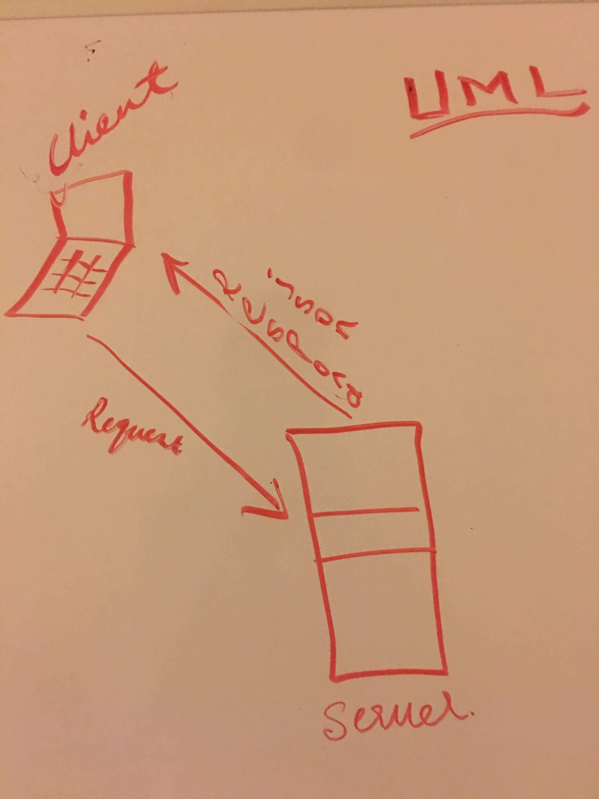

# lab-06

*LAB - Class 06*

### Author: 
  **Eyob Tamir**

### Links and Resources

[swagger-link](https://app.swaggerhub.com/apis-docs/Eyob1984/lab-06/0.1)

### submission PR

[PR](https://github.com/eyobtamir-401n16/lab-06/pull/1)

### ci/cd (GitHub Actions)

### back-end server url (when applicable)
    *http//localhost:3000*
### front-end application (when applicable)
Setup
    **NOT aplicable**
### .env requirements (where applicable)
i.e.
    **NOT aplicable**

### PORT - Port Number
    **3000**
### MONGODB_URI - URL to the running mongo instance/db

    **NOT aplicable**
### How to initialize/run your application (where applicable)
    **e.g.  json-server --watch ./data/db.json**
### How to use your library (where applicable)

### Tests
* How do you run tests? **Not aplicable**
* Any tests of note? **Not aplicable**
* Describe any tests that you did not complete, skipped, etc **Not aplicable**

### UML

